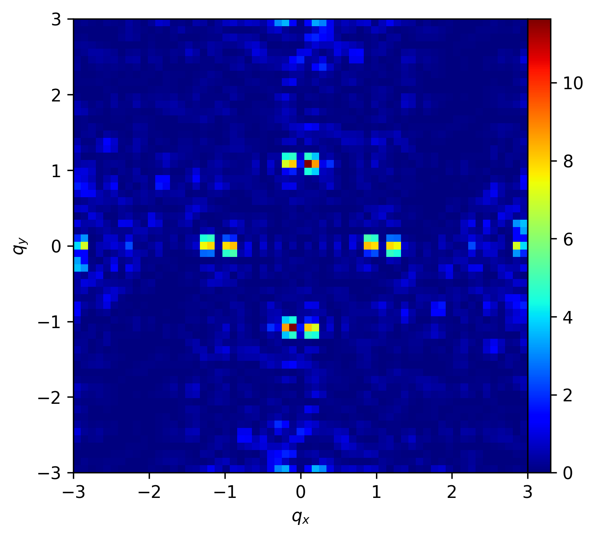

Magnetic structure factor calculator
---

Программа для вычисления магнитного структурного фактора в магнитных системах Изинга на 2D решетках.

## Пример работы программы

Пример для Кирской решетки из папки [test](test). Программа запущена со следующими параметрами:
`./msf -f cyrrhus.mfsys -o cyrrhus_full.dat --qmin=-3 --qmax=3 --qstep=0.1`



## Мат. модель

MSF is calculated by analogy with [this paper](https://www.science.org/doi/10.1126/sciadv.aav6380) and has the same form as in neutron scattering experiments:

$$
  I(\vec{q}) = \frac{1}{N} \sum^N_{i=1} \sum^N_{j=1} \vec{S}_i^\perp \cdot \vec{S}_j^\perp \exp (i \vec{q} \cdot \vec{r}_{i,j}),
$$

where $\vec{S}_i^\perp = \vec{S}_i - (\hat{q} \cdot \vec{S}_i ) \hat{q}$ is the component of the spin vector of each island, $\vec{S}_i$, perpendicular to the reciprocal space vector $\vec{q}$, and $\hat{q} = \vec{q} / |\vec{q}|$.

Функция представлена в комплексном пространстве. При верно проведенных вычислениях значение имеет только действительная часть. Мнимая часть решения при верном решении должна быть равна 0.

Программа строит матрицу значений $\vec{q}$ в заданном интервале с заданным шагом, и вычисляет $I(\vec{q})$ для каждого из возможных значений. Особое достоинство программы - параллелизм. Программа способна выполнять вычисления на нескольких ядрах процессора используя OpenMP.

## Компиляция и запуск программы

Поддерживается только linux. Программа имеет зависимость только от cmake.

Клонируем и собираем проект следующими командами:
```
git clone --recurse-submodules https://github.com/uyras/msf.git
cd msf
mkdir build && cd build
cmake ..
cmake --build . --config Release
```

После успешной сборки в папке build появится бинарный файл `msf`. Для получения справки запустите команду `./msf --help`. Результат запуска:

```
usage: msf --filename FILE.mfsys [--output FILE.txt] [--simple] [--save
FILE.mfsys] [--qmin QMIN] [--qmax QMAX] [--qstep QSTEP] [--rotate ROTATE]
[--normalisePositions NORMALISEPOSITIONS] [--normaliseMoments NORMALISEMOMENTS]
[--bar] [--help]

Program to calculate the magnetic structure factor

required arguments:
  -f, --filename FILE.mfsys   Path to text file with structure of the system.
                              Format is the mfsys file. txt or dat files are
                              also is supported.

optional arguments:
  -o, --output FILE.txt       New file where to save the result. By default it
                              is the old file with '.dat' extention.
  --simple                    Save only Real part as 2D matrix to the file.
                              Needed to reduce the resulting file size. This
                              file further may be directly readed by
                              np.loadtxt() and plotted by plt.imshow()
  -s, --save FILE.mfsys       If set, save scaled and rotated system to .mfsys
                              file.
  --qmin QMIN                 q minimal value
  --qmax QMAX                 q maximal value
  --qstep QSTEP               size of pixel (dQ)
  -r, --rotate ROTATE         Define the angle in degrees if needed to rotate
                              the system
  -p, --normalisePositions NORMALISEPOSITIONS
                              Divide (normalise) all space soordinates by this
                              value. If set 0, use the minimal distance between
                              spins as a value.
  -m, --normaliseMoments NORMALISEMOMENTS
                              Divide (normalise) all M vector by this value. If
                              set 0, use minimal length of M vector as a value.
  -b, --bar                   Enables progress bar. Disabled by default.
  -h, --help                  Display this help message and exit.
```

## Формат входного файла

Параметр `-f, --filename` поддерживает два возможных формата.

1. mfsys формат. Программа определяет его по расширению файла `.mfsys`. Существует две версии формата, они описаны [тут](https://github.com/uyras/partsEngine/wiki/Формат-файла-магнитной-системы). Программа может определять их автоматически.
2. Текстовый формат. Определяется по расширению файла, поддерживаются `.dat` либо `.txt`. В файле каждый спин записывается в строке в формате `x y mx my`. Значения `x`,`y` - координаты точечного диполя, `mx`,`my` - направление вектора магнитного момента. Значения должны быть разделены либо пробелом либо символом табуляции.

## Размерность системы и нормировка

Вектор $q$ считается в тех же пространственных координатах в которых описаны координаты спинов. Например, если спины уложены в решетке, где расстояние между ближайшими спинами 100 единиц, то надо строить q в интервалах (примерно) от -500 до 500. Если расстояние между ближайшими спинами 1 единица, то диапазон значений q от -5 до 5. 

За интервал значений отвечают параметры программы `--qmin`, `--qmax`, `--qstep`. Учтите что количество вычислений имеет квадратичную зависимость от числа точек в указанном диапазоне, так как строится двумерная матрица значений. Увеличение `--qstep` на один порядок приведет к увеличению времени вычислений в 100 раз.

Значения функции $I(\vec{q})$ имеют те же единицы измерения что и $\vec{m}$, исходя из формулы выше.

Программа имеет возможность масштабирования пространственных координат и векторов магнитных моментов. Параметр `-p` и `-m` отвечают за нормировку позиций спинов и векторов магнитных моментов соответственно. Параметры принимают коэффициент масштабирования. Если коэффициент задан как 0, то программа вычислит минимальное расстояние между парой спинов либо минимальную длину магнитного момента, и нормирует на эти значения.

Также можно повернуть систему на определенный угол параметром `-r`.

После применения операторов `-p`, `-m`, `-r` можно сохранить преобразованную систему в файл параметром `-s`. Пока поддерживается только сохранение в .mfsys файлы.

## Формат выходного файла

Результат работы программы сохраняется в текстовый файл, для каждого пикселя приведены следующие значения:
`N	qx	qy	re	im`. Пример файла: [test/cyrrhus_full.dat](test/cyrrhus_full.dat).

Для уменьшения размера файла можно использовать более короткий формат, при котором сохраняются только значения re в виде двумерной матрицы, где столбцы разделены знаком табуляции а строки переносом строки. Этот режим включается параметром `--simple`. Пример файла: [test/cyrrhus_simple.dat](test/cyrrhus_simple.dat)

## Визуализация результата

Пример python кода для визуализации полной версии файла `cyrrhus_full.dat`. Здесь текстовые данные считываются в numpy массив, затем каждый столбец превращается в квадратную матрицу и визуализируется.

```python
import numpy as np
import matplotlib.pyplot as plt

fname="cyrrhus_full.dat"

def sq(arr):
    return arr.reshape((-1,int(np.sqrt(arr.shape[0]))))

arr = np.loadtxt(fname)
qx = sq(arr[:,1])
qy = sq(arr[:,2])
rea = sq(arr[:,3])
ima = sq(arr[:,4])

# draw real part of MSF
plt.figure(dpi = 300)
plt.gca().set_aspect('equal')
plt.xlabel("$q_x$") 
plt.ylabel("$q_y$")
plt.pcolormesh(qx,qy,rea,cmap='jet')
plt.colorbar(pad=0)
```

Для упрощенного варианта вывода `cyrrhus_simple.dat` считывается только массив значений. Их можно напрямую визуализировать функцией `plt.imshow`. Но тогда по осям рисунка будут порядковые номера пикселей. Чтобы правильно нормировать значения, в первую строку файла добавлена консольная строка запуска программы `msf`, из которой можно получить параметры `qmin,qmax` необходимые для визуализации. В примере ниже показано как их можно считать и использовать для визуализации:

```python
import numpy as np
import matplotlib.pyplot as plt
import re

fname = "cyrrhus_simple.dat"

with open(fname) as f:
    line = f.readline()
    qmin = float(re.findall(r'--qmin=([-0-9.eE]+)', line)[0])
    qmax = float(re.findall(r'--qmax=([-0-9.eE]+)', line)[0])

dat = np.loadtxt(fname)
plt.figure(dpi = 300)
plt.gca().set_aspect('equal')
plt.xlabel("$q_x$")
plt.ylabel("$q_y$")
plt.imshow(dat,cmap='jet',extent=[qmin,qmax,qmin,qmax],origin='lower')
cbr = plt.colorbar(pad=0)
```

## Преобразование из длинного формата в короткий

Код для преобразования длинного формата вывода в короткий. 
В новом файле сохраняются все комментарии из старого.
Лежит в файле [test/convert_long_short.py](test/convert_long_short.py).

```python
#!/usr/bin/env python3

import numpy as np
import sys

if len(sys.argv) != 3:
    print(f"Использование: {sys.argv[0]} <input_file> <output_file>")
    sys.exit(1)

input_file = sys.argv[1]
output_file = sys.argv[2]

def sq(arr):
    return arr.reshape((-1,int(np.sqrt(arr.shape[0]))))

pre = "this file is translated from long to short format\n"
with open(input_file) as f:
    for line in f:
        if line[0]=="#":
            pre += line[1:]
        else:
            break

pre = pre.strip()
dat = np.loadtxt(input_file)
rea = sq(dat[:,3])
np.savetxt(output_file,rea,header=pre,fmt='%.8g')
```