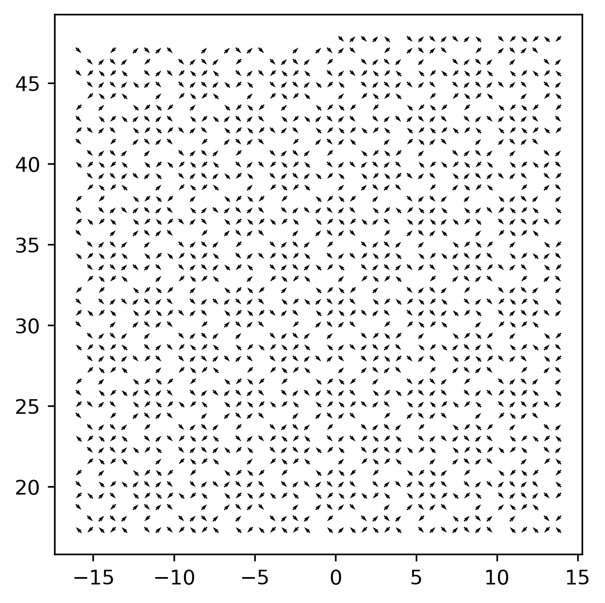

# Файлы для тестирования программы

В файле `cyrrhus.mfsys` описана структура Кирской решетки, распознанная с экспериментального XMCD снимка. Система состоит из 1414 частиц и нормирована таким образом, чтобы ближайшие колиннеарные спины были удалены на расстояние 1, и длина вектора магнитного момента 1. Все вектора направлены диагонально под углами 45/135 градусов.

Система выглядит так:


Запускать так:
```bash
./msf -f cyrrhus.mfsys -o cyrrhus_full.dat --qmin=-3 --qmax=3 --qstep=0.1 -b 
```

Либо для упрощенного файла:
```bash
./msf -f cyrrhus.mfsys -o cyrrhus_simple.dat --qmin=-3 --qmax=3 --qstep=0.1 -b --simple
```

После завершения вычислений эти данные нужно визуализировать.